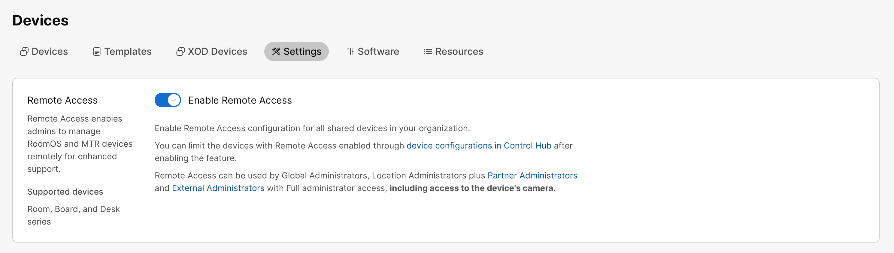
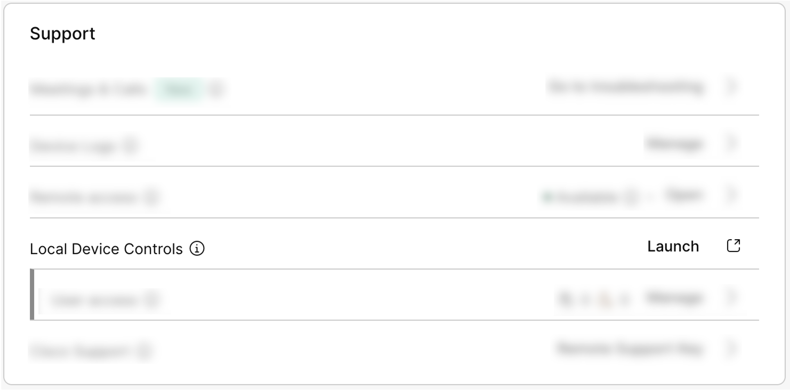
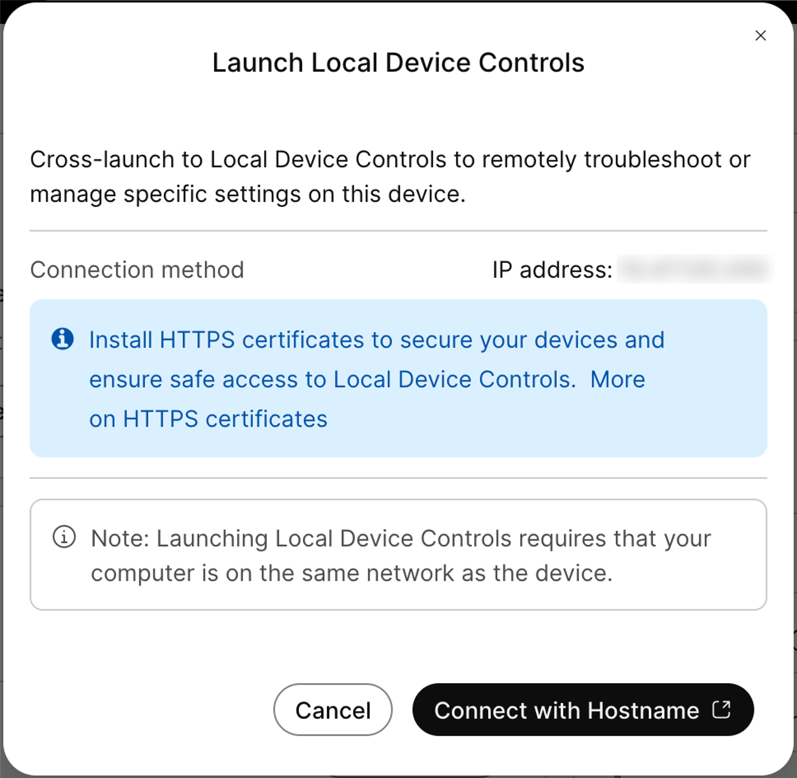
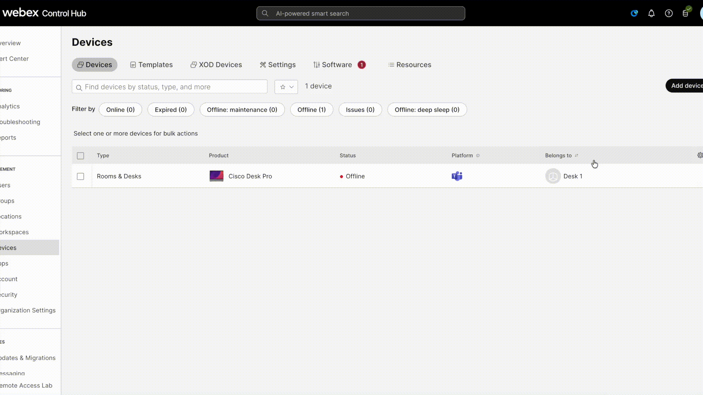

# Guides

## Log in to Control Hub

To log into Control Hub navigate to [admin.webex.com](https://admin.webex.com) and log in with the email and password designated for you.

## Enable Remote Access for your company via Control Hub

To enable Remote Access feature in Control Hub for your company. Navigate to Device -> Settings in control hub, read the description of Remote Acces and toggle on Enable Remote Access.

{ width="500" }

You also have to option to enable/disable Remote Access per device, refer to the [documentation](https://help.webex.com/en-us/article/gge81eb/Remote-access-to-Board,-Desk,-and-Room-Series-devices) for that.

In case you want to activate it directly on a device using the xAPI the public xConfiguration that activated Remote Access is:

> xConfiguration RemoteAccess Mode: On/Off

## Access Local Device Controls from Control Hub

You should know that the local device controls, also known as the device's Web Interface can only be accessed from the same network as the device. 

To access the local device controls first you have to navigate to the device page after searching and finding it on the devices tab. Once you are in the devices page you can click on Launch on the Local Device Controls within the Support card as seen in the image below:

{ width="500" }

Press connect with hostname and you will have access to the Web Inteface of the device

{ width="500" }

??? Note "Accept risks in case you are prompted"
    You are accessing a page hosted on the device, its safe to ignore the warnings from the browser and continue.

You will land on the home page of the Web Interface of the device ass seen in the image bellow:

Having access to this page opens up a series of options that will be usefull for us in this lab. Such as:

- Remote Access from the Web Interface. You can give it a try!
??? Note "Configuration NetworkServices Websocket: FollowHTTPService"
    Using remote access from the device's web interface requires that the configuration NetworkServices Websocket is set to FollowHTTPService.
- Developer API where you can execute xCommand and xConfiguration directly on the device. This can be useful in case you want to control a call with xcommands for instance.
- Macro Editor, where you can create your own macros in combination with UI Extensions. This will be useful for us in the integrator scenario where we will have to visit this page to fix our customizations.
- Call tab. This will be useful in the call scenario where we will have started a call from Remote Access. Remote Access is not supported in call the the remote access session will end and you will be able to control the call from this tab on the Web Interface.

## Using xAPI commands on Control Hub

- To run an xAPI command on Control Hub log in to Control Hub follow the instructions from [Logging into Control Hub](../guides.md). After that find your device and go to the devices page. You will find an _Action_ button with the option of _Run XCommand_. From there you can run commands from https://roomos.cisco.com/xapi directly on the device.

More at [RoomOS xAPI pages](https://roomos.cisco.com/xapi)

## Using xAPI commands on Local Device Controls webpage

- To use Local Device Controls you need to be on the same network as the device.

- To log in to the Web Interface follow the instructions from [Access Local Device Controls from Control Hub](../guides.md). If you have a local user registered on the Local Device Controls you can also log in to Local Device Controls with that user by navigating to the devices ip address.

- Go to Developer API tab and run the commands

More at [RoomOS xAPI pages](https://roomos.cisco.com/xapi)

## Get an Activation Code in CH

In Control Hub from the Devices Page click Add Device -> Shared Usage -> Next -> New Workspace. Here you can give any name for the workspace click Next -> Cisco Room and Desk Devices -> Next (there is no need to change anything). Click on Add Device to get the activation code. That is the code you will use on the device.

??? Note "Show me how to get the activation code in CH"
    