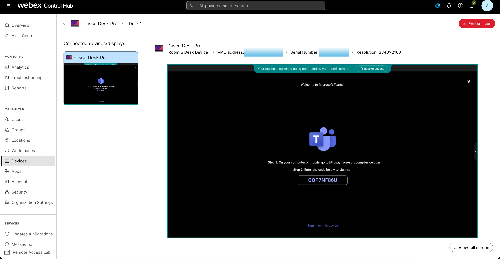
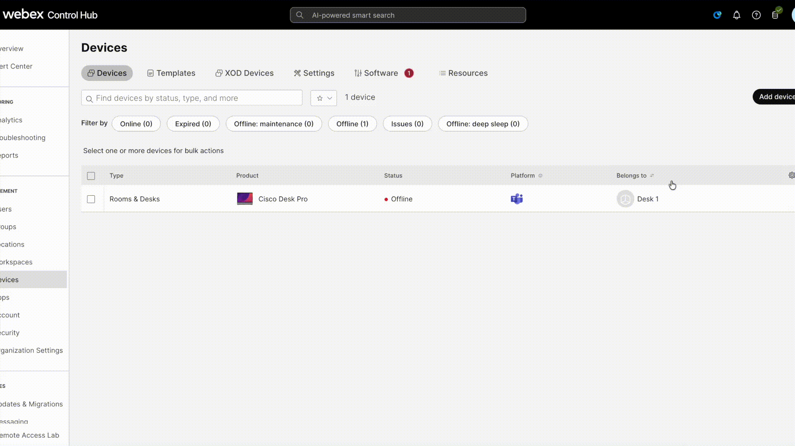
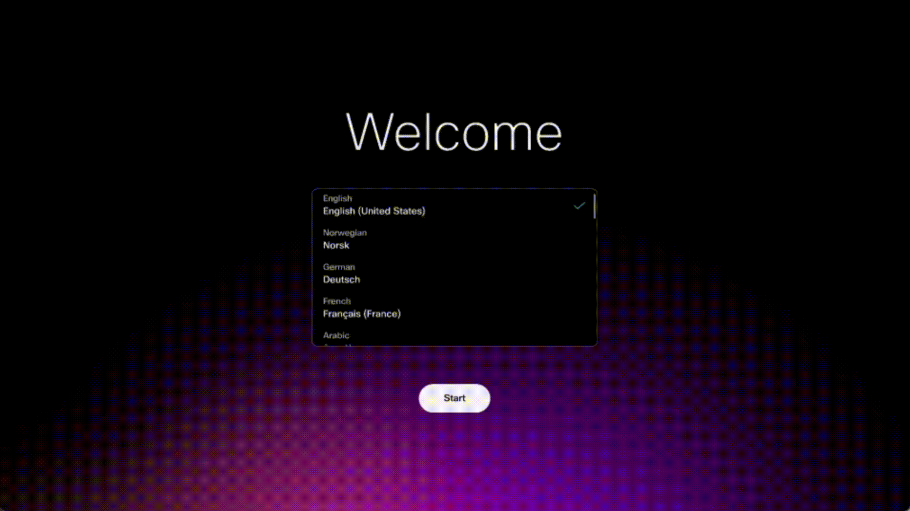

# Scenario 5 - MTR onboarding

In this scenario you will be an admin that needs to get the Microsoft Teams Room (MTR) code that shows on the device to be able to finish the MTR onboarding process. The device still needs to be registered to control hub so we can start a remote access session. Your goal is to see the MTR code on remote access session, we will not go further with the MTR registration. Once you reach this screen you are done with this scenario:

{ width="800" }


But we will need some setup to get to this scenario.

## Setup Steps

### 1 - Factory reset the device. 

Make use of one the guides on how to run an xCommand: 

- [Using xAPI commands on Control Hub](../guides.md#xapi-commands-on-CH)  

- [Using xAPI commands on Local Device Controls webpage](../guides.md#xapi-commands-on-LocalDeviceControls)

An run the following xCommand to factory reset the device:

```
xCommand SystemUnit FactoryReset Confirm: yes
```

This process might take a few minutes.

### 2 - Get an activation code from Control Hub 

In Control Hub from the Devices Page click Add Device -> Shared Usage -> Next -> New Workspace. Here you can give a name for the workspace that you will use to find the device later. Click Next -> Cisco Room and Desk Devices -> Next (there is no need to change anything). Click on Add Device to get the activation code. That is the code you will use on the device.

??? Note "Show me how to get the activation code in CH"
    

We will use the activation code soon on the device, so make sure to save it or have it available to you during step 3.

### 3 - Add the activation code to the device during the MTR onboarding process.

Now that you have the activation code you can input that on the device manually. After the factory rested the device will be on the welcome screen. From here choose all the default options until you see a screen with "Cisco RoomOS Experience" and "Microsoft Teams Experience". Choose Microsoft, then add the activation code. Press "Continue" and then begin installation. Will process will take several minutes. You can move on to the next 

??? Note "Show me how to register device and start MTR onboarding process"
    

### 4 - Start a Remote Access Session
- Go to Control Hub and find the device you registered in step 2.
- Now you are ready to start a remote access session.

### 5 - Verify what is the MTR Code on screen
- If step 3 is still not over, the MTR instalation is still in progress. You might need to wait a few more minutes.
- You should be able to see the MTR code on screen. From this point on as an admin you should be able to finish the registration process on the microsoft login webpage but we will not cover that on this course. 


For a full guide on how to register MTR devices check the documentation on [MTR OnBoarding](https://roomos.cisco.com/doc/MTR/MTROnBoarding#control-hub-registration-after-the-initial-setup). The documentation also describes the scenario of devices already registered to Control Hub being registered to MTR. 


