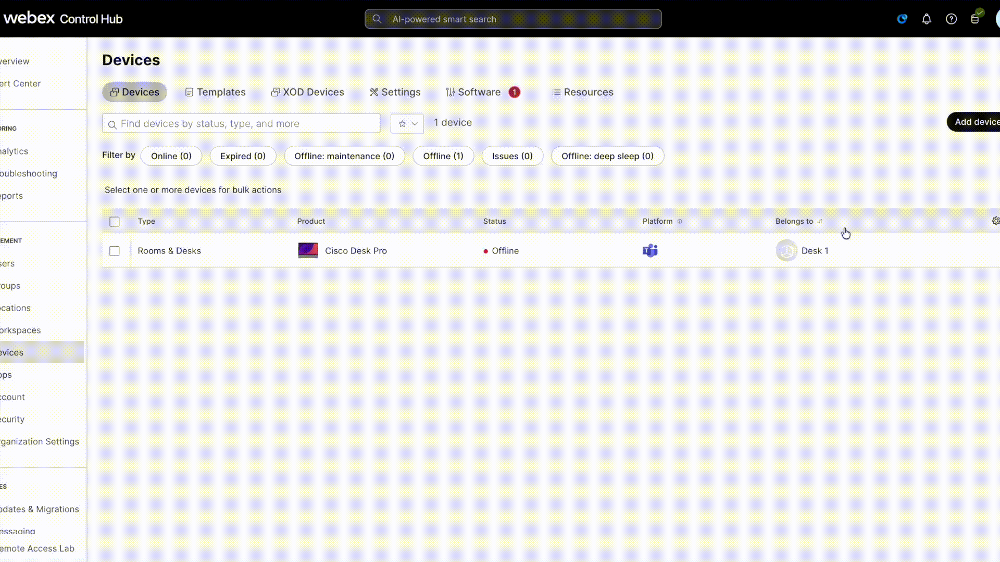

# Scenario 6 - RoomOS onboarding

In this scenario you will be an admin that wants to register a RoomOS device to our org so we can use remote access for future troubleshooting.

Here is the overview of what you need to do in this scenario:

- Factory reset your device.
- Create an activation code in CH.
- Register the device to Control Hub as a RoomOS device.
- Test Remote Access from Local Device Controls.
- Open a whiteboard and play around with mouse and keyboard controls. You can write a message about the training if you want or show off your drawing skills.
- Now do the same from Control Hub, and verify the differences. How does the latency differs? 
- You can also steal a session from you classmates to see how that interaction between two admins works. Just give them a heads up.

You can try to finish this scenario on your own or continue following this guide.


## Setup Steps
We will need some setup to get to this scenario.

### 1 - Factory reset the device. 

Make use of one the guides on how to run an xCommand: 

- [Using xAPI commands on Control Hub](../guides.md#xapi-commands-on-CH)  

- [Using xAPI commands on Local Device Controls webpage](../guides.md#xapi-commands-on-LocalDeviceControls)

An run the following xCommand to factory reset the device:

```
xCommand SystemUnit FactoryReset Confirm: Yes
```

This process might take a few minutes.

### 2 - Get an activation code from Control Hub 

In Control Hub from the Devices page click Add Device -> Shared Usage -> Next -> New Workspace. Here you can give a name for the workspace that you will use to find the device later. Click Next -> Cisco Room and Desk Devices -> Next (there is no need to change anything). Click on Add Device to get the activation code. That is the code you will use on the device.

??? Note "Show me how to get the activation code in CH"
    

We will use the activation code soon on the device, so make sure to save it or have it available to you during step 3.

### 3 - Add the activation code to the device during the onboarding process.

Now that you have the activation code you can input that on the device manually. After the factory reset the device will be on the welcome screen. From here choose all the default options until you see a screen with "Cisco RoomOS Experience", continue and add the activation code. Press "Continue" and the device should register in a few minutes.

### 4 - Start a Remote Access Session
- Go to Control Hub and find the device you just registered with the workspace you created in step 2.
- Now you are ready to start a remote access session.

### 5 - Test out different scenarios.
- Open a whiteboard and try to draw durning a Remote Access session in Control Hub and then do the same from Local Device Controls.
- Steal a session from your colleague and verify how the is the interaction between two admins.


If you manage to go through all the steps you have finished our training, well done! 

!!! important "But wait a minute"
    During this scenario we still needed to be in the room to type the activation code on the device. In room presence was still needed. Wait for the instructor to finish the course to hear some new on that topic. 

??? Note "You have finished the training! The instructor will soon wrap up the course."
