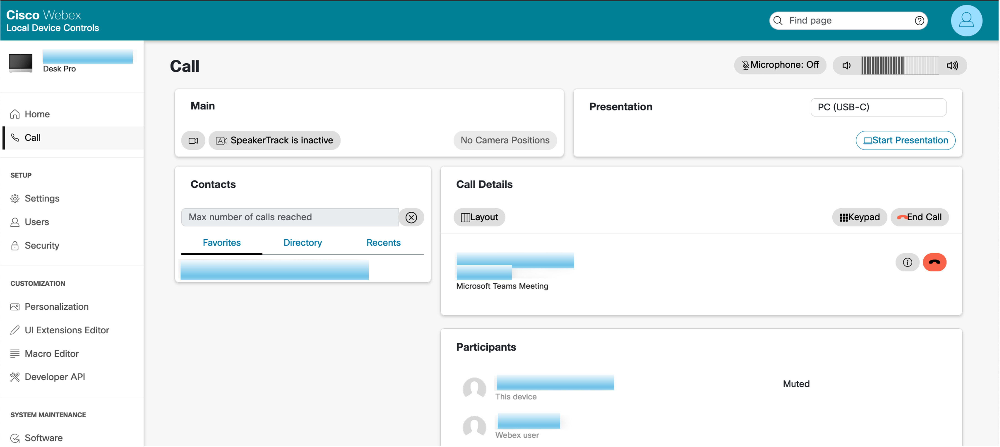

## Start a call for the end user

## Problem

In this scenario you will start a call from remote access for the end user but they want the continued support during the call. Remote Access during a call is not supported so we will have to find ways to continue supporting the call using other tools from Webex.

## Your task

In this scenario you will start a remote access session, and from the device you will start a call on the device. Once the call is established the remote access session will be closed since its not supported in call. From here you have 2 options to continue to give support for the call, one is use the xAPI commands. But the best available option is to log in to Local Device Control and use the Call tab to control the call.

1. Start a Remote Access session. To start a Remote Access session follow the instructions from [Hello Remote Access](./helloRemoteAccess.md).

2. Start a new meeting. The start a new meeging click on the Webex button on the home screen of the device and then click on _Start a new meeting_.

3. You will notice the remote access session will be closed. To continue to give support for the call user either Option 1 - Local Device Control and use the Call tab to control the call or Option 2 - Use the xAPI commands.

4. Once you have played with the call controls either on the Local Device Controls or using the xAPI commands you can end the call remotely.

### Option 1: Use Local Device Control to log in to the Web Interface and give support for the call tab in the Web Interface

- This is the preferred way today to continue giving support for devices during a call.
- To log in to the Web Interface of the device follow the instructions from [Access Local Device Controls from Control Hub](../guides.md#local-device-controls-from-CH).

- Once logged in navigate to the Call tab. Here you will have full control over the call on the device. You can play around with the controls, mute, unmute, etc. Should look something like this:

{ width="500" }

### Option 2: Use the xAPI to continue giving support for the call

It is possible to use xAPI to continue giving support for the call. You can do that by using xAPI commands from [RoomOS xAPI page](https://roomos.cisco.com/xapi). You can execute them on Control Hub, over the Web Interface, or directly on the device. 

You have two options with the XAPI commands approach:

- [Using xAPI commands on Control Hub](../guides.md#xapi-commands-on-CH)
- [Using xAPI commands on Local Device Controls webpage](../guides.md#xapi-commands-on-LocalDeviceControls)

From there you can run commands that will allow you to control the call. A list of relevant commands are described below.

#### Here are a few xAPI commands you can run to control the call

Here are a few examples:

```
xCommand Call Disconnect
xCommand Presentation Start
xCommand Presentation Stop
xCommand Audio Microphones Mute
xCommand Audio Volume Decrease/Increase

``` 


These are the option available for now for controlling the call on a device without remote access in the discussed scenario. Using the Call tab on Local Device Controls is the best available option for now.


Lets move on to our challenge scenario [Scenario 5 - MTR onboarding](./scenarios/MTROnBoardingFromCH.md).