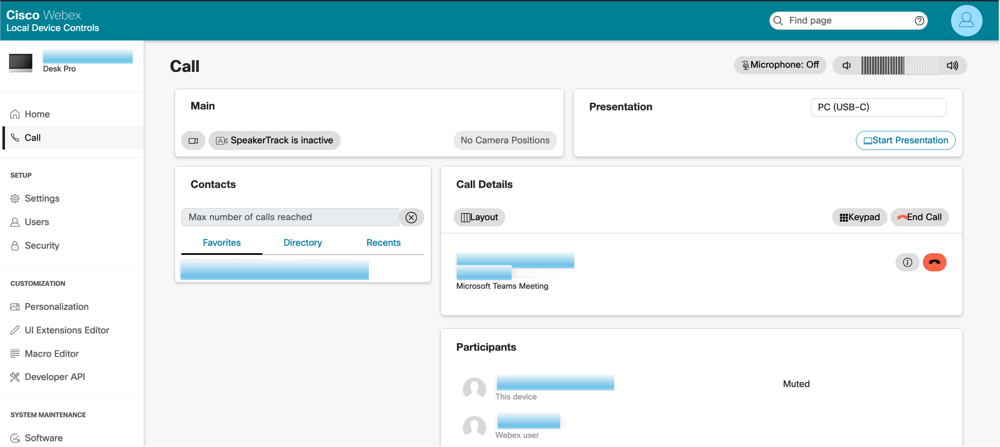

## Start a call for the end user

## Problem

In this scenario, you will start a call from Remote Access for the end user, but they want the continued support during the call. Since Remote Access during a call is not supported, we need to use other Webex tools to continue providing support.

## Your task

In this scenario, you will start a Remote Access session, and from the device you will start a call on the device. Once the call is established the Remote Access session will be closed since its not supported in call. From here, you have 2 options to continue to provide support for the call: (1) use the xAPI commands or (2)log in to Local Device Control and use the Call tab. The recommended option is using the call tab on Local Device Control.

1. Start a Remote Access session. To start a Remote Access session follow the instructions from [Hello Remote Access](./helloRemoteAccess.md).

2. Start a new meeting. To start a new meeting, click on the Webex button on the device’s home screen, then press Start a new meeting.

3. You will notice the Remote Access session will be closed. To continue to provide support for the call user either: Option 1 - Local Device Control and use the Call tab to control the call or Option 2 - Use the xAPI commands.

4. Once you have tested the call controls either on the Local Device Controls or using the xAPI commands you can end the call remotely.

### Option 1: Use Local Device Control to log in to the Web Interface and give support for the call tab in the Web Interface

- This is the preferred way today to continue giving support for devices during a call.
- To log in to the Web Interface of the device follow the instructions from [Access Local Device Controls from Control Hub](../guides.md#local-device-controls-from-CH).

- Once logged in, navigate to the Call tab. Here you will have full control over the call on the device. You can play around with the controls, mute, unmute, etc. The interface should look something like this:

{ width="500" }

### Option 2: Use the xAPI to continue giving support for the call

You can also use xAPI to continue giving support for the call. You can do that by using xAPI commands from [RoomOS xAPI page](https://roomos.cisco.com/xapi). You can execute them on Control Hub, over the Web Interface, or directly on the device. 

You have two options with the XAPI commands approach:

- [Using xAPI commands on Control Hub](../guides.md#xapi-commands-on-CH)
- [Using xAPI commands on Local Device Controls webpage](../guides.md#xapi-commands-on-LocalDeviceControls)

From there you can run commands that will allow you to control the call. A list of relevant commands is provided below.

#### Here are a few xAPI commands you can run to control the call

Here are a few examples:

```
xCommand Call Disconnect
xCommand Presentation Start
xCommand Presentation Stop
xCommand Audio Microphones Mute
xCommand Audio Volume Decrease/Increase

``` 


These are the available options for controlling the call on a device without Remote Access in this scenario. Using the Call tab on Local Device Controls is the best available option for now.


Let’s move on to our next scenario, where we will not use the devices in our lab. The instructor will present [Scenario 5 - MTR onboarding](./scenarios/MTROnBoardingFromCH.md).