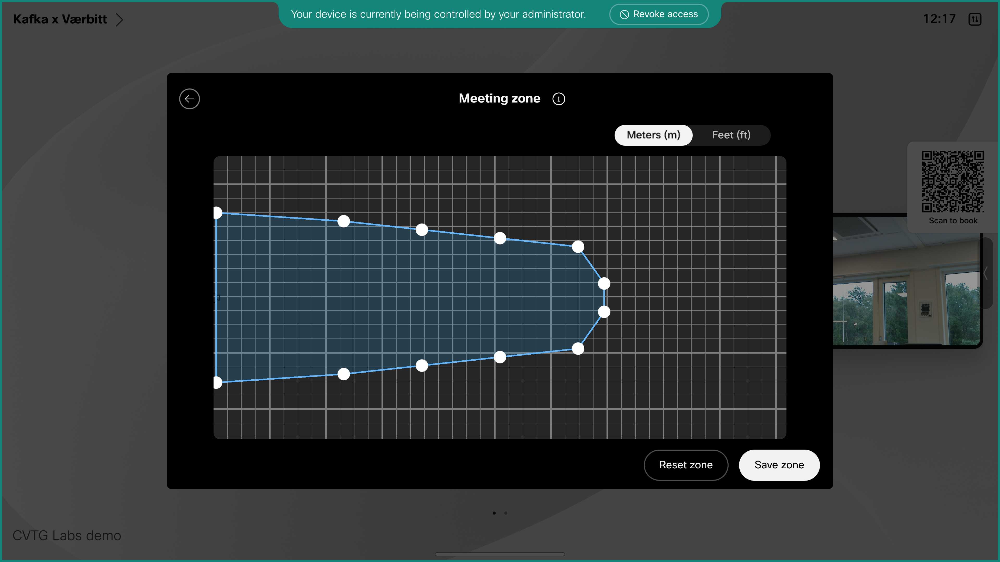

# Scenario 2 - Camera

## Problem

In this scenario the end user is reporting the camera is misaligned.

As an admin it might be hard to explain to the user how to fix it by themselves, it would require a few messages back and forward at least.

Heading to the location of the endpoint could be costly as well so to solve this scenario we will use Remote Access to help the end user configure the camera and also set up meeting zones.

### User report:

> The camera on my device is always aiming at the floor, it always worked as expected until last week when it was used for a different presentation when the camera angle was changed. Can you come fix this?
Here is a screenshot of the device:
{ width="500" }

## Your task

In this scenario what you will need to do is start a remote access session, access the settings of the device, and fix the camera view so the end user is supported:

- To start a Remote Access session follow the instructions from [Hello Remote Access](./helloRemoteAccess.md).

- After the session is established you will have access to the devices as if you are in the room, first thing to do is check the current state of the self view. To do so go to settings by clicking the top right settings icon { width="30" }. Click on the camera icon and set Camera mode to Auto/Dynamic instead of Manual. Here you can also have a visual confirmation that the camera is pointing at a reasonable place. There are additional things you could do here such as apply different backgrounds or  blur the background. Or even set up Meeting Zone to prevent from possible issues in the future.

### Setting up meeting zones

- An additional improvement the end user experience is configure the meeting zone. On the device navigate to Device Settings -> Camera -> Meeting Zones. As seen in the image here you can outline the area that the device should focus when having a meeting. Meeting Zones allows you to limit the area of interest for the speaker tracker and video framing logic allowing the device to reach better results when deciding what to include in the video frames.

{ width="500" }

You can now be sure that you have solved an issue for the user with minimal effort, no presence in the room was needed, and you improoved the meeting experience.

We are ready for the next scenario where we will take the role of an integrator and be sure our deployment is working as expected: [Scenario 3 - Customizations](./customizationsScenario.md).
