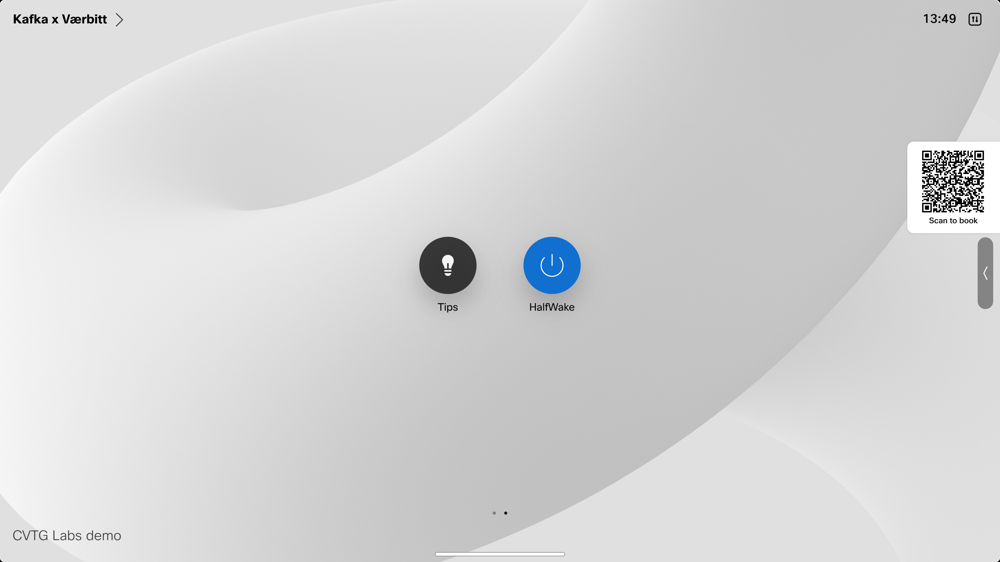
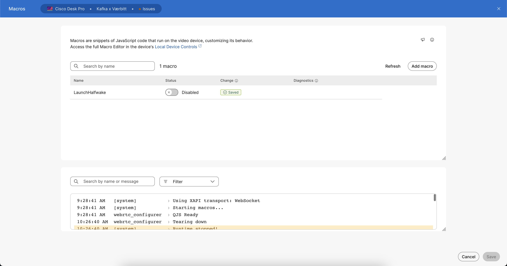

# Scenario 3 - Customizations 

## Half Wake Integration

In this scenario you are an experienced integrator and you have deployed some customizations with UI extensions and macros. Its called [Launch Halfwake](https://roomos.cisco.com/macros/Launch%20Halfwake) and it put the device in a halkwake state showing signage with the URL set by the integrator.

## Problem

In this scenario you are an integrator and you have deployed a customization with a UI extension (button) and a macro. You installed a button on the home screen that puts the device in a halfwake state and shows a signage web page, for that to work you also have installed a macro called _LaunchHalfwake.js_. Your task here is to verify that the custom button added to the home screen does what its designed to do.

As an integrator you wanna go to the room and test your customizations to be sure it works and is ready for customers to use.

By clicking this button on the home screen (you might need to swipe to the next page of home screen on the device to find it):
{ width="500" }

Your goal is to verify that after clicking on the Halfwake button the user will see the Signage web page opening on the device.

## Your task

In this scenario you want to start a remote access session and verify that your integration is working. You will see that its in fact not working exactly as expected. You just caught and error before reaching the end user! Well Done!

Since in this scenario you are an expert integrator you know exactly what to do to fix this issue. From the devices overview page you will need to go to the macros tab inside Control Hub, and activate the Launch Halfwake macro to get the correct behavior.

Here is the Macros page in CH where you should activate the LaunchHalfwake macro and hit save:
{ width="800" }

Once you have done that you will be able to verify with a remote access that the custom button works as expected. You should click on it and verify that the webpage opens on the device to be sure your integration is working.

If you are familiar with the UI extensions and macro engine you can play with the code a bit and test the behavior with remote access. 
You can also install macros from the public macro repository available here: https://roomos.cisco.com/macros (please check the disclaimer section before using any macro from the public repository on you deployed devices).

Lets move over to [Scenario 4 - Customizations](./callScenario.md).

