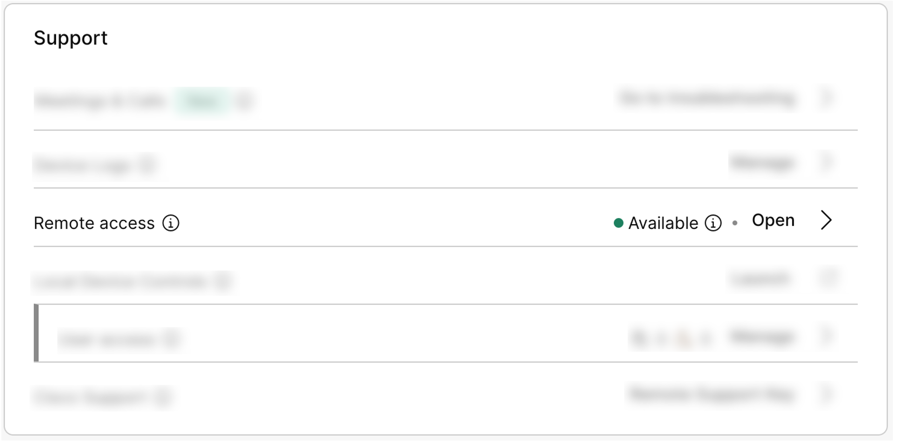
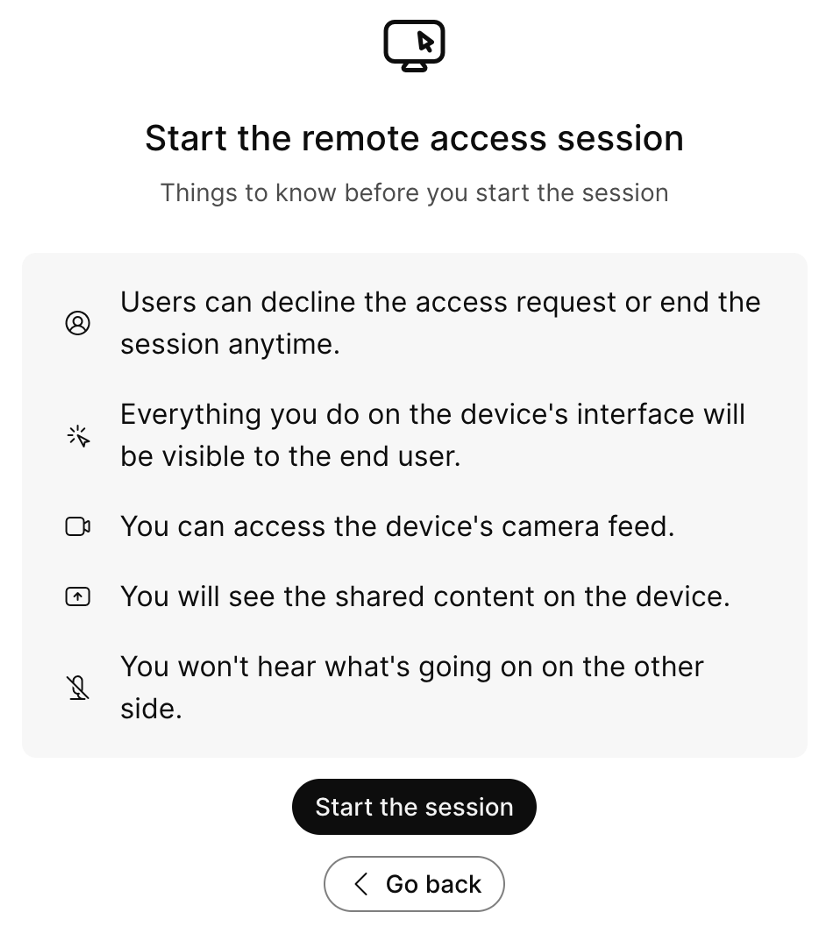

# Hello Remote Access 

## Your first remote access session

To get started lets make sure we can start a remote access session on your device. We first need to make sure the settings are properly set and you can start a remote access session from control hub. 

Remote Access is already enabled on the org we are using, but for reference this is how you would activate the feature, by following [Enable Remote Access for your company via Control Hub](../guides.md#enable-remote-access) guide.

Once that is done log into Control Hub, on the devices tab search for your device and click on it. You will land on the device's page in control hub where you have a lot of information and extensive control over the device. What interests us is the Remote Access feature in the support card as seen in the image below:

{ width="500" }

Click open and you will land on the Remote Access page.

Here you can see the occupancy and state of the room on the top and, as an admin, decide if you want to start your session now or when the room is empty.

Here you can also have an overview of the capabilities of the feature and be reminded of a few things before starting the session:

{ width="500" }

Once you click "Start the session" the device will open a popup message along with a sound cue letting any user present know the a remote access session is about to start. After 20 seconds the session will start and you will have control over the device from Control Hub.

If you are able to see the device interface on control hub you are ready for the first scenario!
Lets go to [Scenario 1 - Language](./languageScenario.md).
