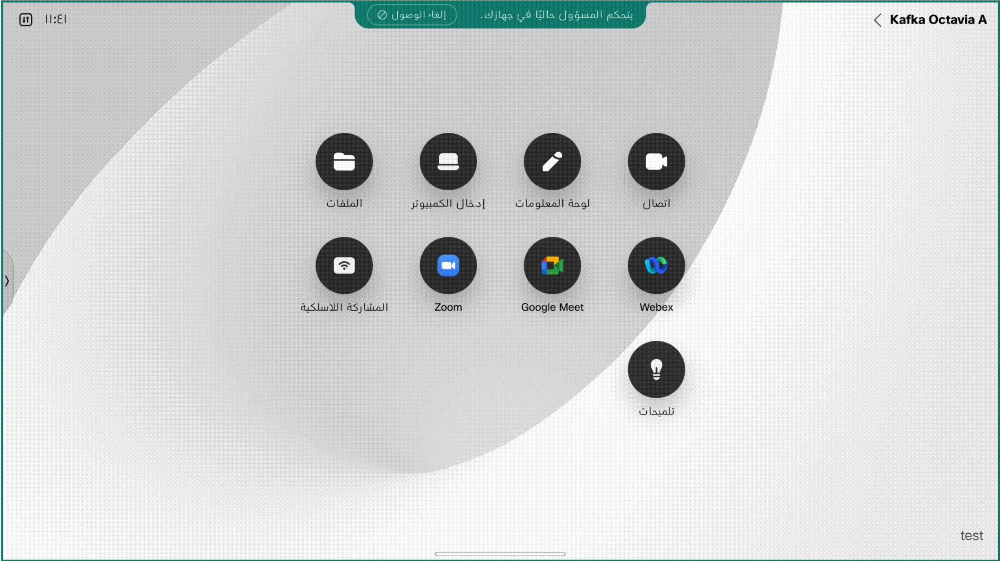
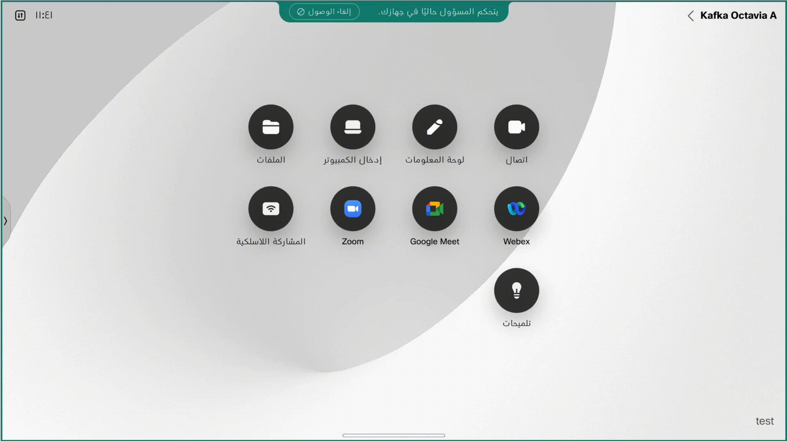

# Scenario 1 - Language 

Lets warm up with a simple scenario.

## Problem

In this scenario the end user is reporting that they are not able to understand the UI at all as its in a unfamiliar language to the user and the buttons seem to be in the opposite side, not wherethey are expected to be. In this case the language is an RTL language that was previously set due to a visit from foreign customers.

As an admin it might be hard to explain to the user how to change the language in the UI on RTL for an unexperienced user. You will fix it using a remote access session as a warm up exercise.

It is perfectly possible to fix this using our xAPI over Control Hub or the Local Device Control, but we will use Remote Access to give support to the user and as a way to have a visual verification that the UI on the device has changed properly.

### User report:

> I am not able to use my device since I do not know the language and the buttons are in the opposite side of where they used to. Could you please come to this meeting room to fix it? Can you set the Language to English?
Here is a screenshot of the device:
{ width="700" }

## Your task

In this scenario what you will need to do is start a remote access session, access the settings of the device, and set the language of the device to English so the user is able to use the device in the language they requested.

- To start a Remote Access session follow the instructions from [Hello Remote Access](./helloRemoteAccess.md).

- After the session is stablish you will have access to the devices as if you are in the room. You will see that the language is not set to English, and the buttons are in a different position. Setting the language to english will also change the location of the buttons to the default position. Go to settings by clicking the top left settings icon { width="30" }, or on the left side of the screen perform a swipe right movment. 

- On the bottom of the screen on the side panel click settings, the button with the cog icon { width="30" }, from here click on the button with the icon { width="30" } that represent languages. From here select English. After that the device will switch to English, and you can verify that visually and assure the user the issue is fixed. No need for a trip to the meeting room in question.

- You can now be sure that you have solved an issue for your customer with minimal effort and no need to be present in the room.

??? Note "Show me how to change the Language"
    

Lets move on to the next scenario [Scenario 2 - Camera](./cameraScenario.md).
